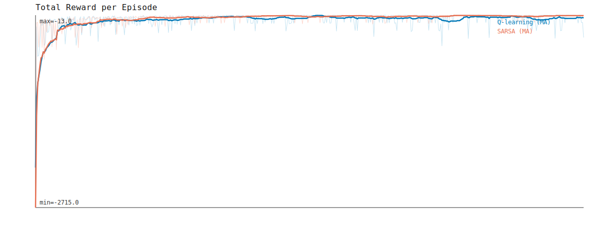
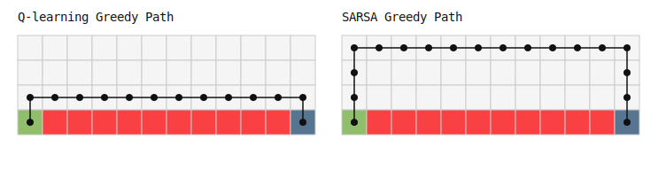

# G1-DRL-HW2-Q-learning-And-SARSA

## 1. 結果分析

### 學習表現
- 已繪製每一回合的累積獎勵（Total Reward）曲線：`report/total_reward_curve.svg`

- 比較收斂速度：
  - Q-learning convergence episode: `145`
  - SARSA convergence episode: `382`
- 補充觀察（最後 100 回合平均 reward）：
  - Q-learning: `-53.04`
  - SARSA: `-22.75`

### 策略行為
- 已視覺化最終學習路徑：`report/final_policy_paths.svg`

- 最終路徑長度：
  - Q-learning greedy path length: `13`
  - SARSA greedy path length: `17`
- 冒險/保守傾向（risk score 越高表示離懸崖越遠、越保守）：
  - Q-learning: `1.00`
  - SARSA: `2.625`
- 解讀：Q-learning 較貼近懸崖、路徑較短；SARSA 較保守、路徑較長。

### 穩定性分析
- 學習波動比較（最後 100 回合 reward 標準差）：
  - Q-learning: `75.94`
  - SARSA: `19.63`
- 解讀：SARSA 波動明顯較小，訓練後期更穩定。

### 探索（exploration）影響
- 在 epsilon=`0.1`、評估 200 回合下：
  - Q-learning 掉崖次數：`68`
  - SARSA 掉崖次數：`8`
  - Q-learning 平均每回合 reward：`-52.865`
  - SARSA 平均每回合 reward：`-22.74`
- 解讀：在有探索噪聲時，SARSA 在此環境更安全，平均表現也較佳。

## 2. 理論比較與討論

在報告中，以下概念成立：

- Q-learning 為離策略（Off-policy）方法，其更新基於「下一狀態的最佳可能行動」，即使該行動未實際執行。  
  更新式：`Q(s,a) <- Q(s,a) + alpha * [r + gamma * max_a' Q(s',a') - Q(s,a)]`

- SARSA 為同策略（On-policy）方法，其更新基於「實際採取的行動」，因此會反映探索策略的影響。  
  更新式：`Q(s,a) <- Q(s,a) + alpha * [r + gamma * Q(s',a') - Q(s,a)]`

一般而言：
- Q-learning 傾向學習到理論上的最優策略，但在訓練過程中可能較具風險。
- SARSA 則傾向學習在實際探索策略下較安全、穩定的行為。

本次實驗也符合上述趨勢：Q-learning 收斂快但風險與波動較高；SARSA 收斂較慢但更穩定保守。

## 3. 結論

### 哪一種方法收斂較快
- 本實驗中 Q-learning 較快（`145` vs `382`）。

### 哪一種方法較穩定
- 本實驗中 SARSA 較穩定（std `19.63` < `75.94`，且掉崖 `8` < `68`）。

### 何種情境下應選擇 Q-learning 或 SARSA
- 選 Q-learning：當你重視較快逼近理論最優、且能接受較高風險與波動。
- 選 SARSA：當你重視穩定性與安全性，或環境存在高懲罰區（如 cliff）。
